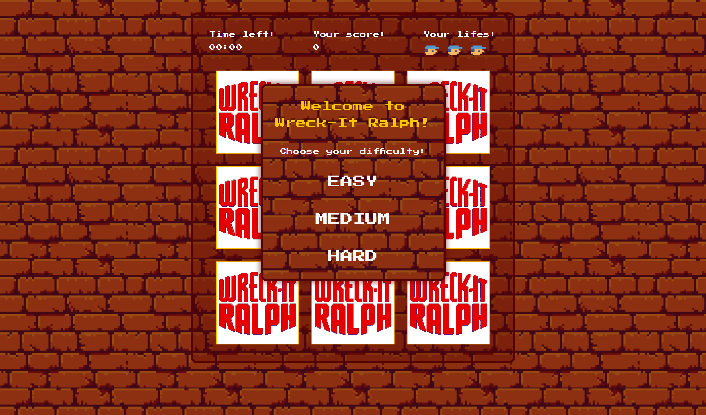

# 🕹️ Wreck-It Ralph! – DOM Practice Project

> A simple game inspired by the amazing *Wreck-It Ralph* movie.

---

## 📌 About the Project

This project was created during the **"Building a Wreck-It Ralph Game with JavaScript"** bootcamp on [DIO (Digital Innovation One)](https://www.dio.me/). The goal of the game is to click on Ralph as he appears in different panels. This project helped reinforce concepts in **DOM manipulation**, **event handling**, and **basic game logic** using JavaScript.

---

## 🎮 Game Features

- Time-based gameplay
- Random enemy generation
- Scoring system
- Life system and game-over logic

---

## 🚀 How to Play

1. Open [the game](https://pamellasoto.github.io/wreck-it-ralph-bootcamp/) in your browser.
2. Choose a difficulty level.
3. Click on Ralph whenever he appears.
4. Avoid clicking the wrong spots — you'll lose lives!
5. The game ends when time runs out, you lose all lives, or Ralph takes over all panels.

---

## 📝 License

This project is for educational purposes and not intended for commercial use.
